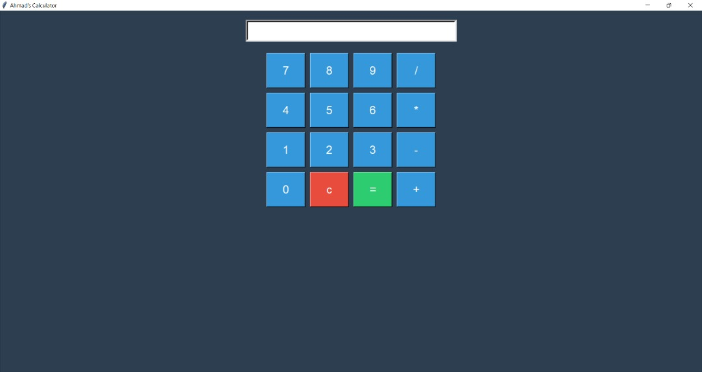

#Simple Calculator App
A basic calculator GUI built with **Python** and **Tkinter**.

##Features
- Addition, subtraction, multiplication, and division
- Clear and equals buttons
- Colorful, responsive layout
- Error handling for invalid inputs

##Screenshot



##How to Run
1. Make sure you have Python installed  
2. Download `calculator.py`  
3. Open your terminal  
4. Run this command:

```bash
python calculator.py
🛠 Built With
Python

Tkinter

Author
Ahmad Gandi
Learning to code and build real stuff one app at a time 
